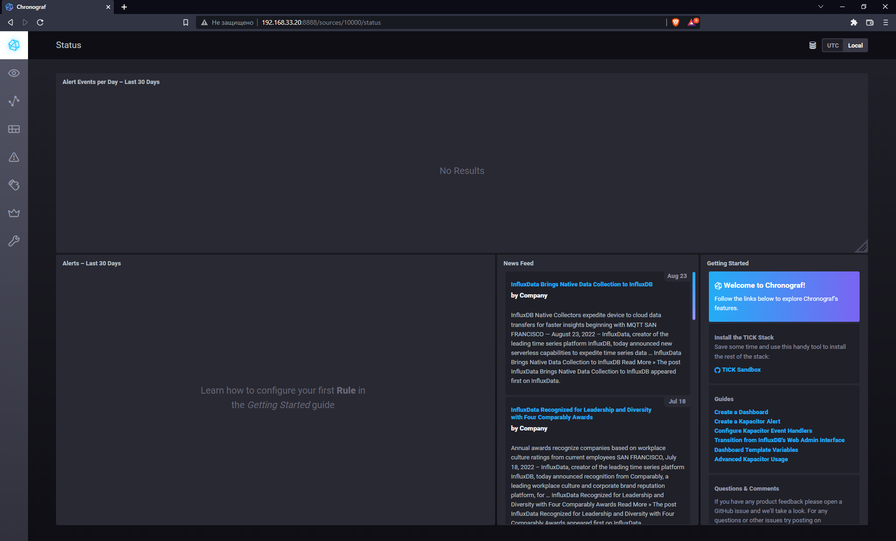
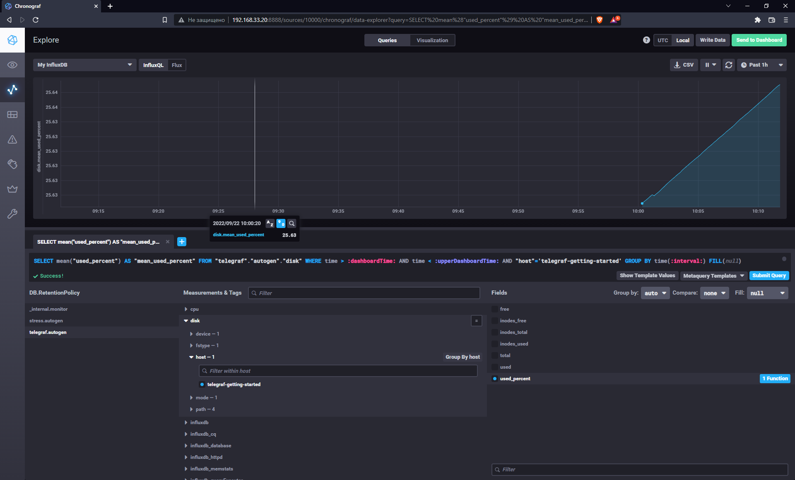
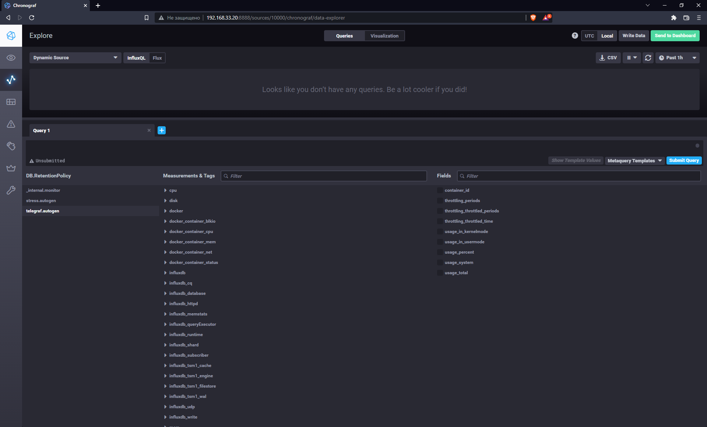

# Домашнее задание к занятию "10.02. Системы мониторинга"

1. Опишите основные плюсы и минусы pull и push систем мониторинга.

1. Какие из ниже перечисленных систем относятся к push модели, а какие к pull? А может есть гибридные?

    - Prometheus 
    - TICK
    - Zabbix
    - VictoriaMetrics
    - Nagios

1. 
```
root@vagrant:/home/vagrant/sandbox# curl http://localhost:8086/ping
root@vagrant:/home/vagrant/sandbox# curl http://localhost:8888
<!DOCTYPE html><html><head><meta http-equiv="Content-type" content="text/html; charset=utf-8"><title>Chronograf</title><link rel="icon shortcut" href="/favicon.fa749080.ico"><link rel="stylesheet" href="/src.9cea3e4e.css"></head><body> <div id="react-root" data-basepath=""></div> <script src="/src.a969287c.js"></script> </body></html>root@vagrant:/home/vagrant/sandbox#
root@vagrant:/home/vagrant/sandbox# curl http://localhost:9092/kapacitor/v1/ping
root@vagrant:/home/vagrant/sandbox#
```
  
.   
  
1.   

1. .

---
