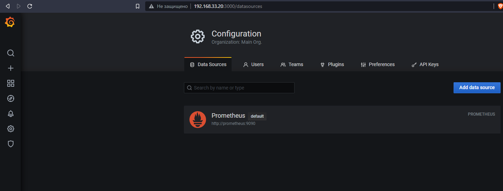
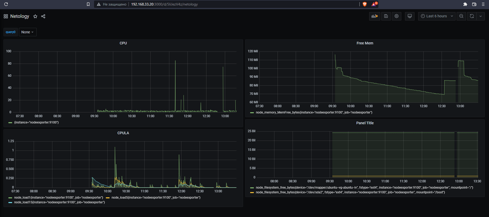
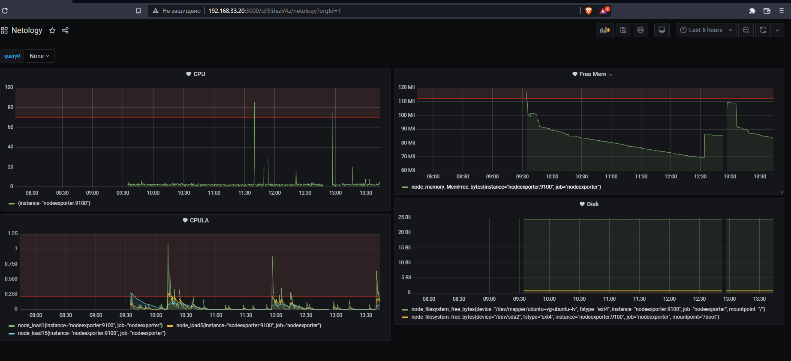

# Домашнее задание к занятию "10.03. Grafana"

### Задание 1


## Задание 2

- Утилизация CPU для nodeexporter (в процентах, 100-idle)
```
100 - avg by (instance) (rate(node_cpu_seconds_total{mode="idle"}[15s])) * 100
```
- CPULA 1/5/15
```
node_load1
node_load5
node_load15
```
- Количество свободной оперативной памяти
```
node_memory_MemFree_bytes
```
- Количество места на файловой системе
```
node_filesystem_free_bytes{fstype!~"tmpfs|fuse.lxcfs|squashfs|ramfs|vfat"}
```



## Задание 3


## Задание 4

[Листинг dashboard.json](dashboard.json).

---

