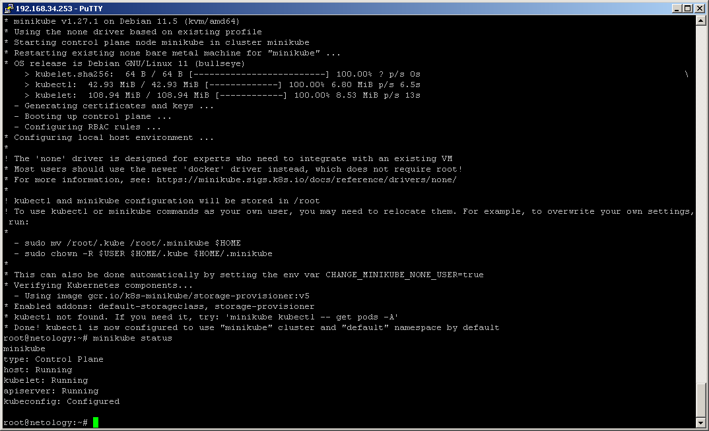
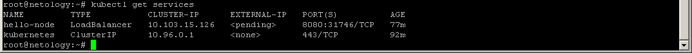
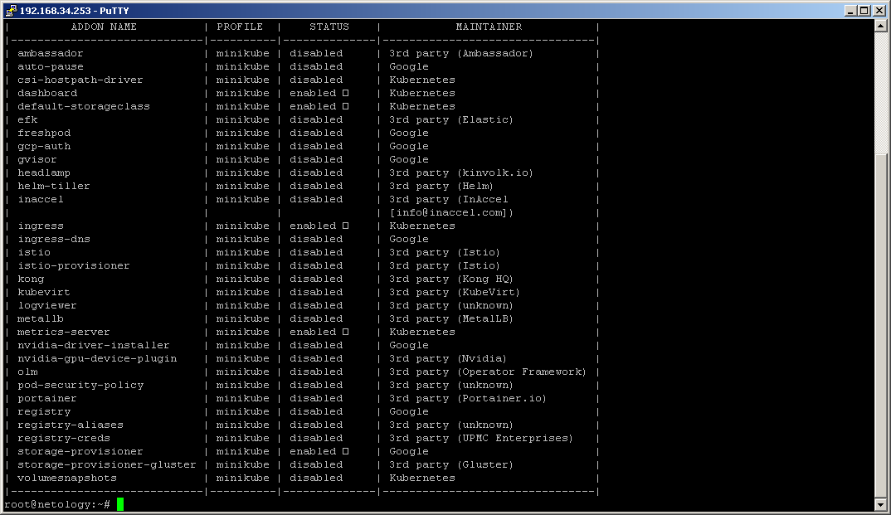
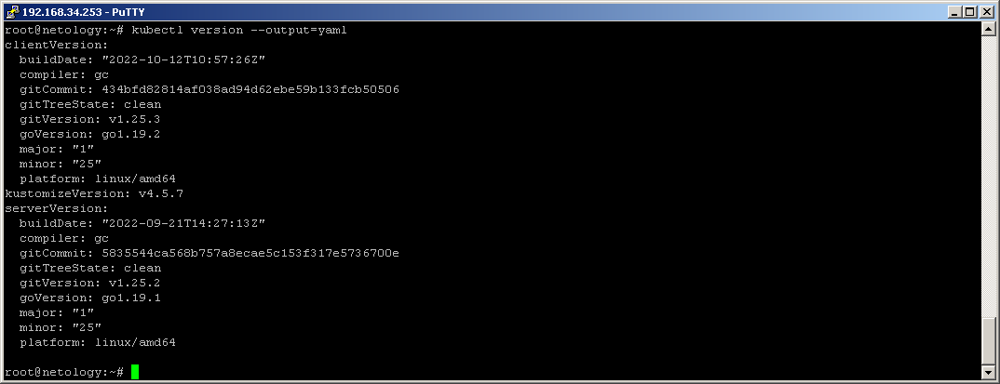
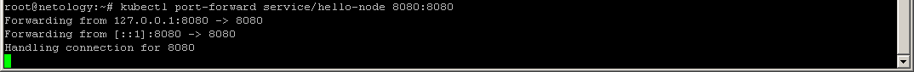
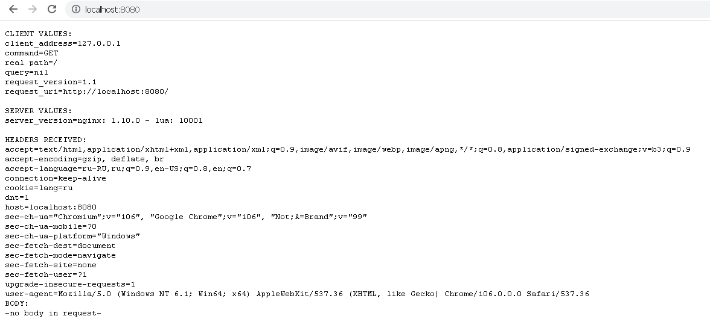

# Домашнее задание к занятию "12.1 Компоненты Kubernetes"

## Задача 1: Установить Minikube
  
  

## Задача 2: Запуск Hello World

- развернуть через Minikube тестовое приложение  
  
  
- установить аддоны ingress и dashboard  

## Задача 3: Установить kubectl
  
  
  
  
