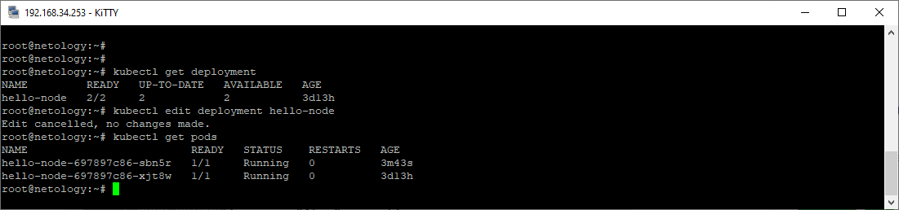
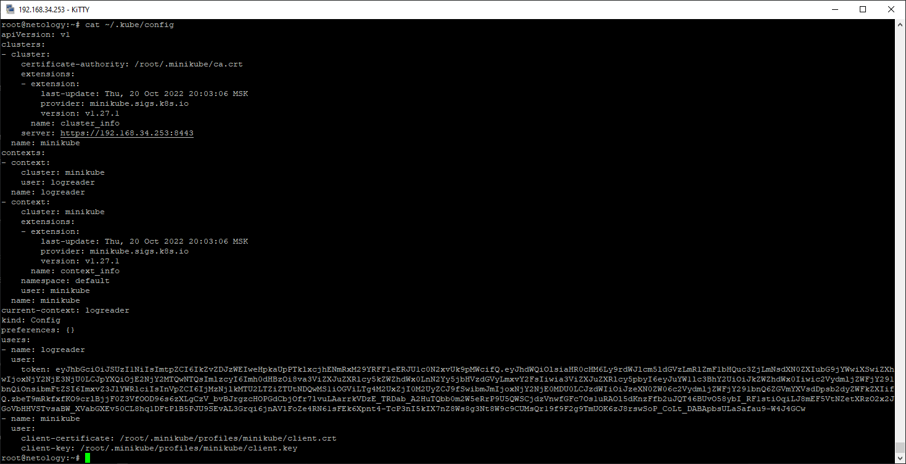
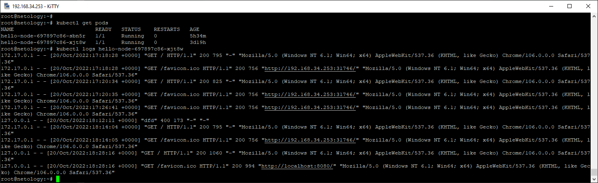
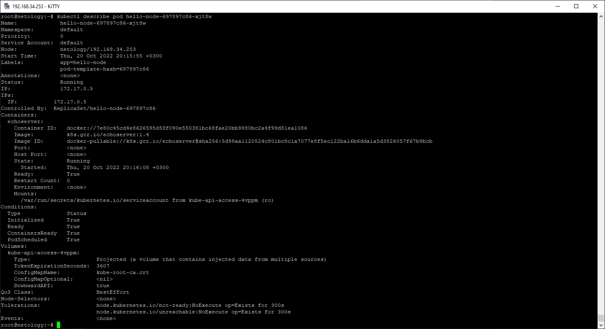
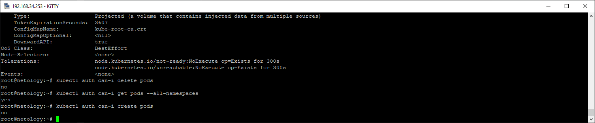

# Домашнее задание к занятию "12.2 Команды для работы с Kubernetes"

## Задание 1: Запуск пода из образа в деплойменте

## Задание 2: Просмотр логов для разработки
  
  
  
  
  
  
## Задание 3: Изменение количества реплик 
  
  
  