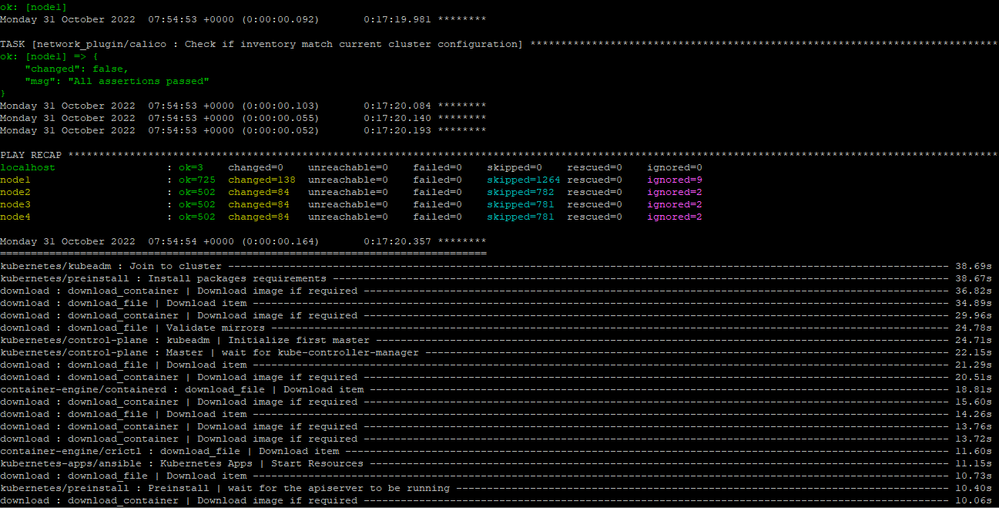
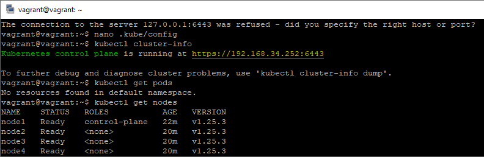

# Домашнее задание к занятию "12.4 Развертывание кластера на собственных серверах, лекция 2"
  
## Задание 1: Подготовить инвентарь kubespray

```
git clone https://github.com/kubernetes-sigs/kubespray.git

cd kubespray

cp -rfp inventory/sample inventory/mykube

declare -a IPS=(192.168.34.252 192.168.34.251 192.168.34.250 192.168.34.249)

CONFIG_FILE=inventory/mykube/hosts.yaml python3 contrib/inventory_builder/inventory.py ${IPS[@]}
```
  
Сагласно тербованиям (1 мастер и 4 рабочие ноды, запуск etcd производить на мастере) изменил [hosts.yaml](hosts.yaml).  
  
CRI изменять не пришлось, в конфигурационом файле по умолчанию стоит требуемый containerd.
/inventory/mykube/group_vars/k8s_cluster/k8s-cluster.yml
```
## Container runtime
## docker for docker, crio for cri-o and containerd for containerd.
## Default: containerd
container_manager: containerd
```
  
```
ansible-playbook -i inventory/mykube/hosts.yaml  --become --become-user=root cluster.yml
```

  

Скоировал к себе config с master-node для подключения.
И проверил.




  