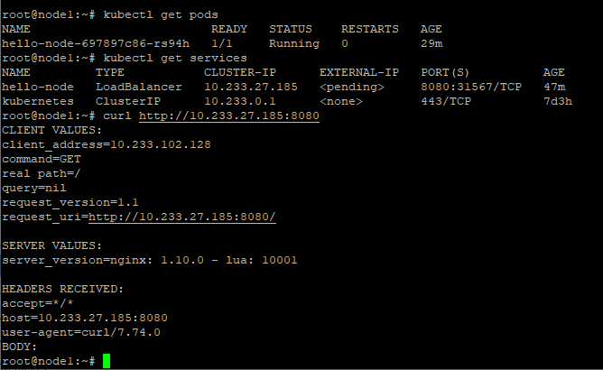
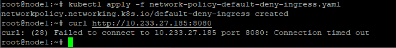
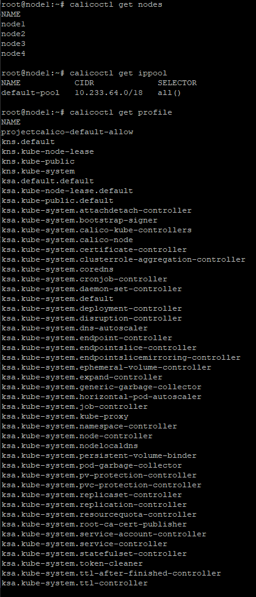

# Домашнее задание к занятию "12.5 Сетевые решения CNI"

## Задание 1: установить в кластер CNI плагин Calico
  
kubespary использую из прошлого задания.  
в нём развернут под hello-node  
  
настроил политику Default deny all ingress traffic  
```
---
apiVersion: networking.k8s.io/v1
kind: NetworkPolicy
metadata:
  name: default-deny-ingress
spec:
  podSelector: {}
  policyTypes:
  - Ingress
```
  

## Задание 2: изучить, что запущено по умолчанию

  
