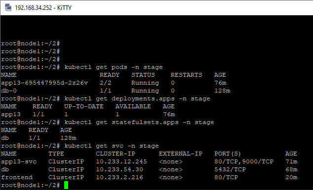
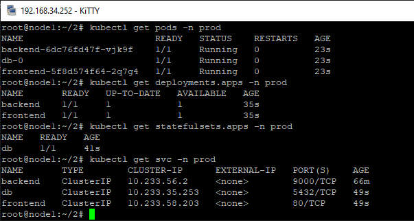

# Домашнее задание к занятию "13.1 контейнеры, поды, deployment, statefulset, services, endpoints"
Настроив кластер, подготовьте приложение к запуску в нём. Приложение стандартное: бекенд, фронтенд, база данных. Его можно найти в папке 13-kubernetes-config.

## Задание 1: подготовить тестовый конфиг для запуска приложения
  
[конфиг файлы для деплоя](1/)  
  
  
  
## Задание 2: подготовить конфиг для production окружения
  
[конфиг файлы для деплоя](2/)  
  
  
    
---