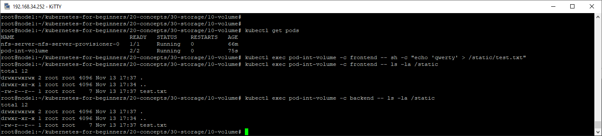
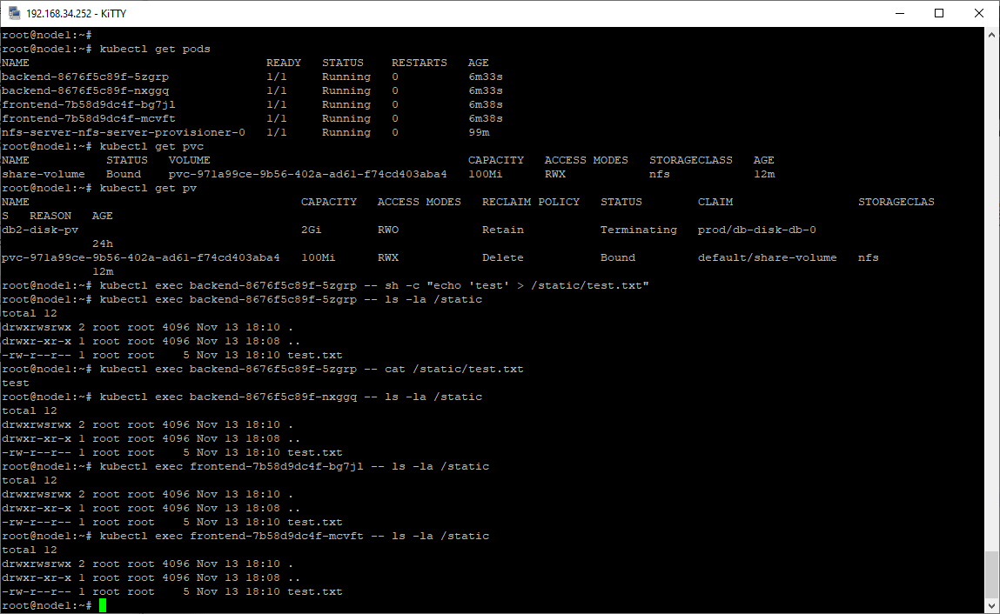

# Домашнее задание к занятию "13.2 разделы и монтирование"

## Задание 1: подключить для тестового конфига общую папку
  
[конфигурация](1/10-pod-int-volumes.yaml)  
  
  
## Задание 2: подключить общую папку для прода  

[конфигурации](2/)  
  
  
---  