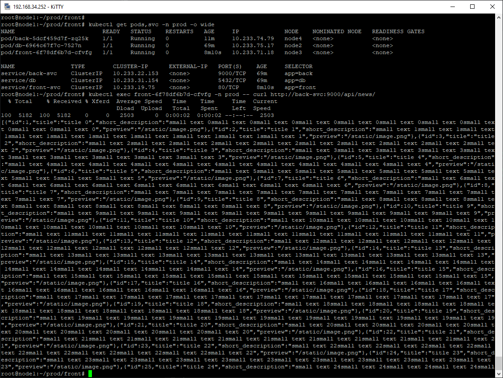
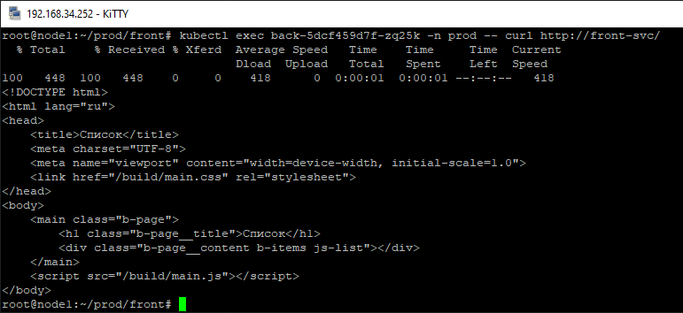
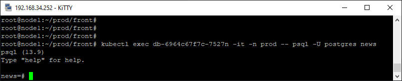
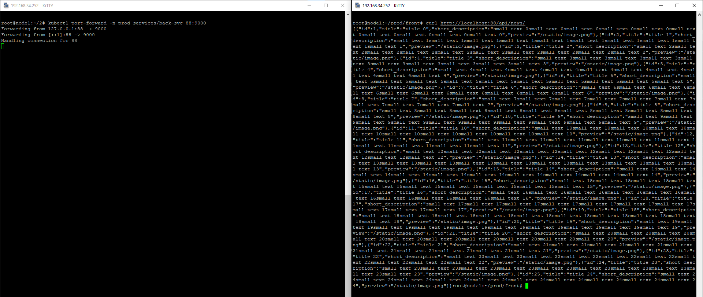
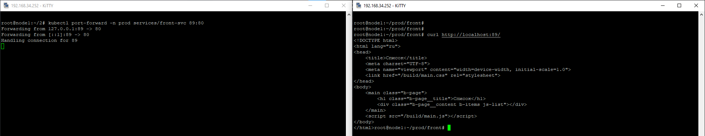
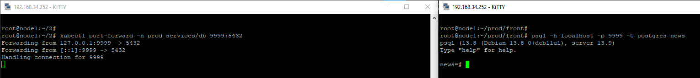
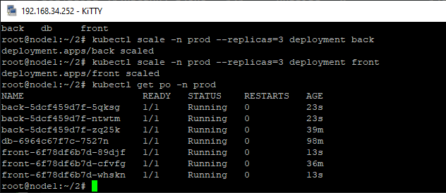
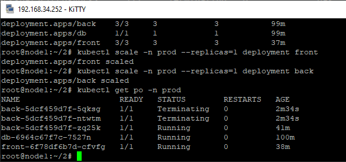

# Домашнее задание к занятию "13.3 работа с kubectl"
## Задание 1: проверить работоспособность каждого компонента
  
  
  
  

  
  
  
      
## Задание 2: ручное масштабирование

  
  

---
