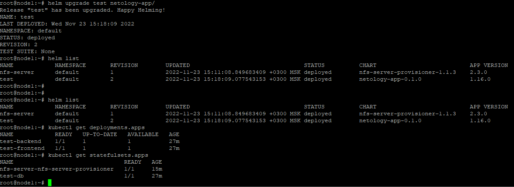
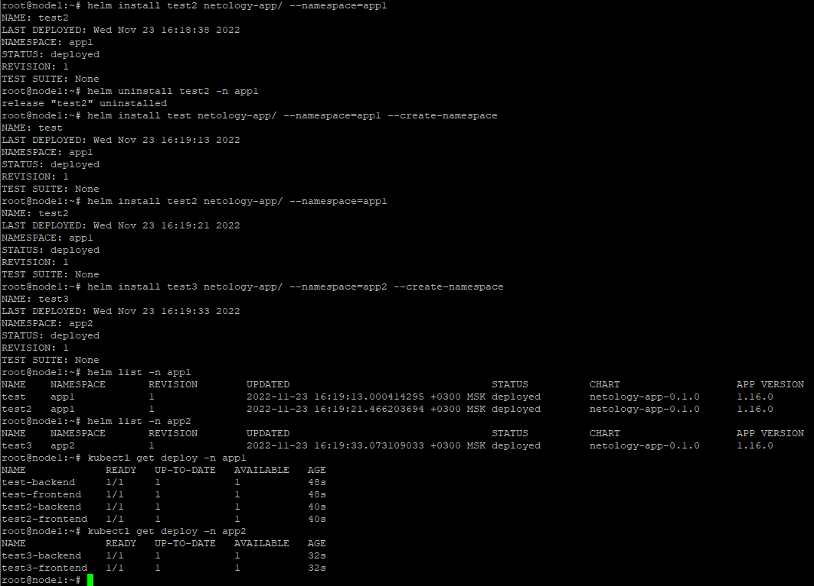

# Домашнее задание к занятию "13.4 инструменты для упрощения написания конфигурационных файлов. Helm и Jsonnet"

## Задание 1: подготовить helm чарт для приложения
  
* [приложение в чарте](netology-app/)  
* 

## Задание 2: запустить 2 версии в разных неймспейсах

