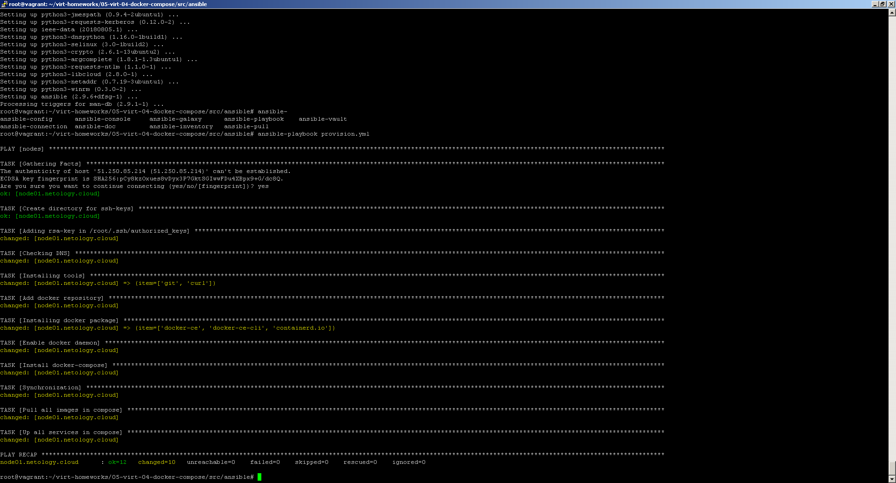
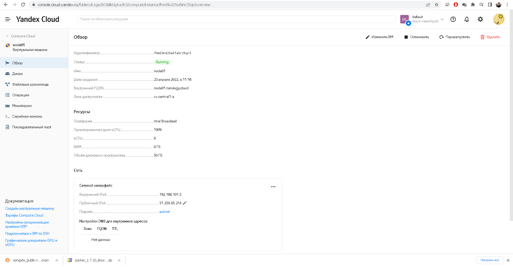
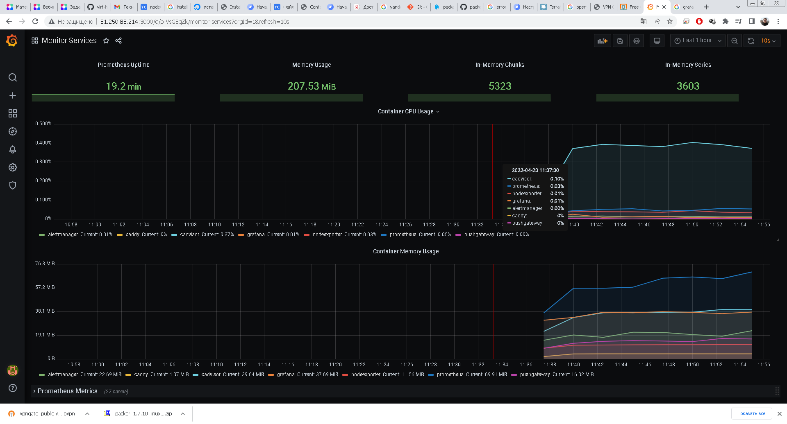

# Домашнее задание к занятию "5.4. Оркестрация группой Docker контейнеров на примере Docker Compose"

## Задача 1
- Скриншот страницы, как на слайде из презентации (слайд 37).

## Задача 2

- Скриншот страницы свойств созданной ВМ, как на примере ниже:

## Задача 3

- Скриншот работающего веб-интерфейса Grafana с текущими метриками, как на примере ниже
