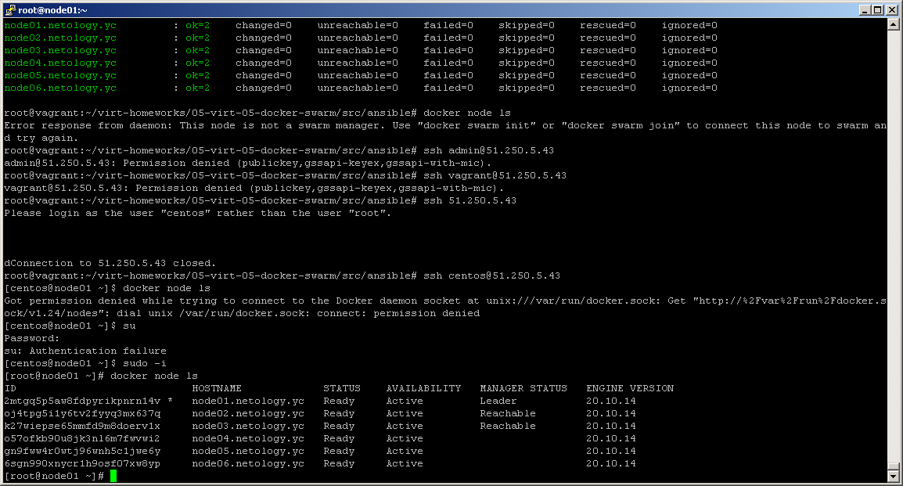
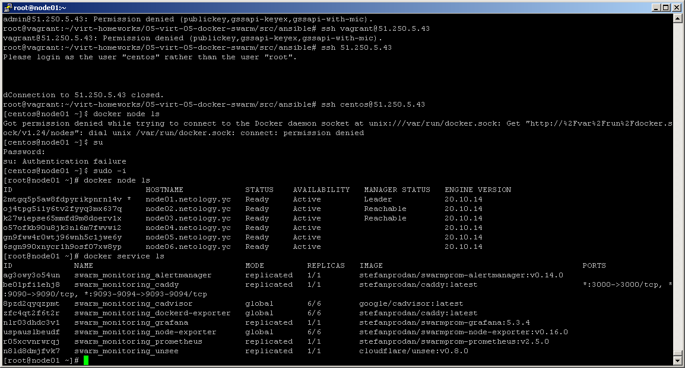

# Домашнее задание к занятию "5.5. Оркестрация кластером Docker контейнеров на примере Docker Swarm"

## Задача 1

Дайте письменые ответы на следующие вопросы:

- В чём отличие режимов работы сервисов в Docker Swarm кластере: replication и global?    
В режиме global задача запускается на каждой node, количества реплик нет.  
В режиме replication указвается количетво node, на которых будет запущена задача.  
  
- Какой алгоритм выбора лидера используется в Docker Swarm кластере?   
Для выбора лидера в Docker Swarm кластере используется алгоритм поддержания распределенного консенсуса Raft.  
  
- Что такое Overlay Network?  
Overlay Network - логическая сеть, обычно строится поверх какой-либо физической.  
  
## Задача 2  
  
Создать ваш первый Docker Swarm кластер в Яндекс.Облаке  
  
  
  
## Задача 3  
  
Создать ваш первый, готовый к боевой эксплуатации кластер мониторинга, состоящий из стека микросервисов.  
  
  
  